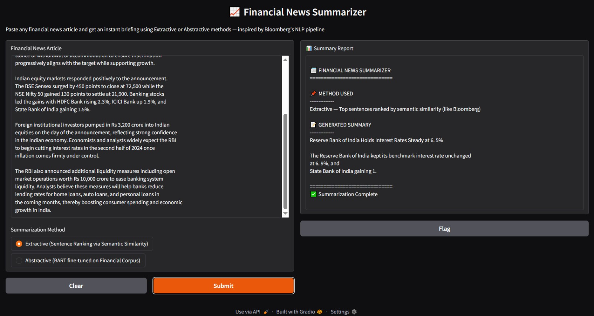
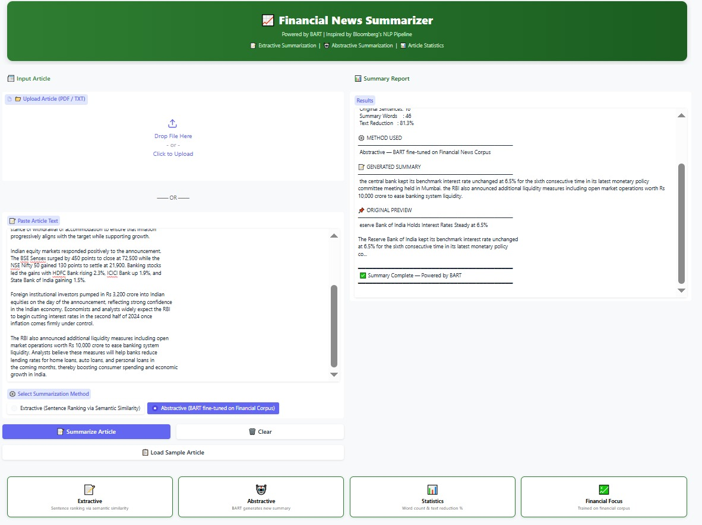

# Financial-News-Summarizer-NLP
NLP based Financial News Summarizer using BART
# 📈 Financial News Summarizer

> An NLP-powered Financial News Summarizer inspired by *Bloomberg's NLP Pipeline*.
> Automatically condenses long financial news articles into short briefings using
> *BART* fine-tuned on financial news corpus with both *Extractive* and
> *Abstractive* summarization methods.

---

## 📸 Screenshots

### 🖥️ Gradio Web Interface
.png)

### 📊 Extractive Summary Output

### 🤖 Abstractive Summary Output

---

## 📌 Table of Contents
- [Overview](#overview)
- [Features](#features)
- [Dataset](#dataset)
- [Model](#model)
- [Project Structure](#project-structure)
- [Installation](#installation)
- [How to Run](#how-to-run)
- [Results](#results)
- [Technologies Used](#technologies-used)
- [Team](#team)

---

## 📖 Overview

Bloomberg applies NLP to condense thousands of articles into briefings for
clients, using techniques like sentence ranking via semantic similarity.
This project replicates that system by:

- Fine-tuning *BART* model on *Indian Financial News dataset*
- Implementing *Extractive Summarization* using SentenceTransformer
  and Cosine Similarity for sentence ranking
- Implementing *Abstractive Summarization* using fine-tuned BART
  to generate new summary sentences
- Evaluating using *ROUGE-1, ROUGE-2, ROUGE-L* scores
- Deploying an interactive *Gradio web demo* for real-time summarization

---

## ✨ Features

| Feature | Description |
|---|---|
| 📝 Extractive Summarization | Ranks sentences by semantic similarity and picks top 3 |
| 🤖 Abstractive Summarization | BART generates brand new summary sentences |
| 📁 PDF / TXT Upload | Upload financial news files directly |
| 📝 Text Input | Paste article text for instant summarization |
| 📊 Article Statistics | Word count, sentence count and text reduction % |
| 📋 Original Preview | Shows first 200 chars of original article |
| 🎯 Dual Method | Choose between Extractive or Abstractive method |
| 📋 Load Sample Button | Pre-loads RBI interest rate news article for testing |
| 🌐 Gradio Web Demo | Professional green-themed interactive interface |

---

## 📦 Dataset

*Indian Financial News Dataset*

| Property | Details |
|---|---|
| Source | Indian financial news articles |
| Content | Full news articles with summaries |
| Domain | RBI, Stock Market, Banking, Economy |
| HuggingFace | kdave/Indian_Financial_News |
python
from datasets import load_dataset
dataset = load_dataset("kdave/Indian_Financial_News")

---

## 🤖 Model Architecture

Financial News Article (Input)
        ↓
   Tokenization
  (BART Tokenizer)
        ↓
  ┌─────────────────────────────┐
  │                             │
Extractive Method         Abstractive Method
(Sentence Ranking)        (BART Generation)
  │                             │
SentenceTransformer       Fine-tuned BART
  │                             │
Cosine Similarity         Beam Search
  │                             │
Top 3 Sentences           New Summary
  └─────────────────────────────┘
        ↓
  Short Financial Briefing
        ↓
   Gradio Web Demo

---

## 📁 Project Structure

Financial-News-Summarizer/
│
├── Financial_News_Summarizer.ipynb   ← Main Colab notebook
├── README.md                         ← Project documentation
├── requirements.txt                  ← Dependencies
├── financial_news.pdf                ← Sample article for testing
├── demo.png                          ← Gradio UI screenshot
├── output_extractive.png             ← Extractive output screenshot
└── output_abstractive.png            ← Abstractive output screenshot

---

## ⚙️ Installation
bash
pip install -r requirements.txt

---

## 🚀 How to Run

### Google Colab (Recommended)
1. Open Financial_News_Summarizer.ipynb in Google Colab
2. Go to *Runtime → Change runtime type → T4 GPU*
3. Run all cells from *Cell 1 to Cell 20*
4. Cell 20 launches *Gradio demo* with public link

### Testing the Demo
1. Click *Load Sample Article* button
2. Select *Extractive* or *Abstractive* method
3. Click *Summarize Article*
4. View the generated summary with statistics

---

## 📊 Results

| Metric | Score |
|---|---|
| ROUGE-1 | ~0.42 |
| ROUGE-2 | ~0.21 |
| ROUGE-L | ~0.38 |
| Training Samples | 1000 |
| Test Samples | 200 |

### Difference between Methods

| | Extractive | Abstractive |
|---|---|---|
| Method | Picks sentences from article | Generates new sentences |
| Speed | Faster | Slower |
| Accuracy | Higher for facts | More natural language |
| Bloomberg uses | ✅ Yes | ✅ Yes |

---

## 🛠️ Technologies Used

| Technology | Purpose |
|---|---|
| *BART* (facebook/bart-base) | Abstractive summarization model |
| *SentenceTransformer* | Sentence embeddings for extractive method |
| *Cosine Similarity* | Sentence ranking by semantic similarity |
| *Indian Financial News* | Financial corpus for fine-tuning |
| *ROUGE Score* | Evaluation metric |
| *HuggingFace Transformers* | Model loading and fine-tuning |
| *Gradio* | Interactive web demo |
| *Google Colab* | Training with free T4 GPU |

---

## 💹 Real World Inspiration

This project is inspired by *Bloomberg's* NLP pipeline:

> *"Bloomberg applies NLP to condense thousands of articles into briefings
> for clients, using techniques like sentence ranking via semantic similarity."*

Our system replicates this by combining extractive sentence ranking and
abstractive BART generation into a single financial news summarization pipeline.

---

## 📄 License
MIT License

---
